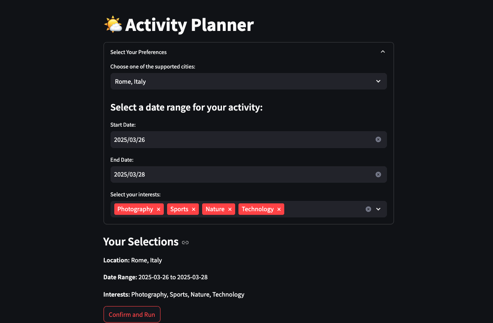
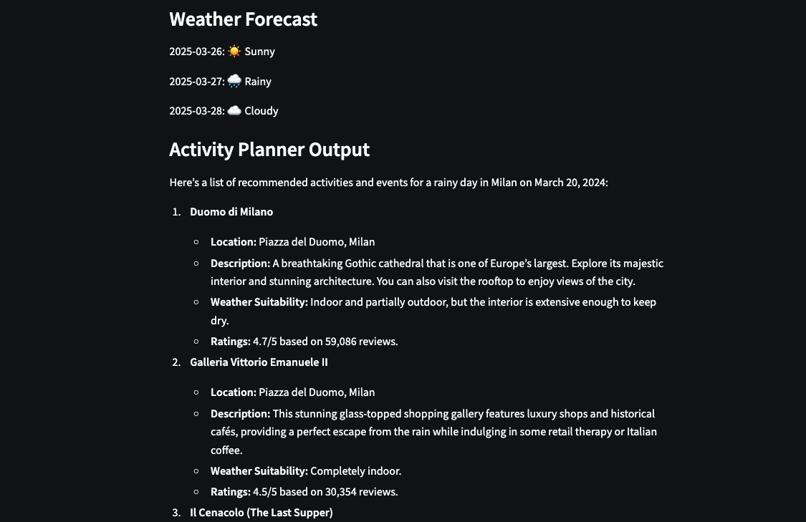
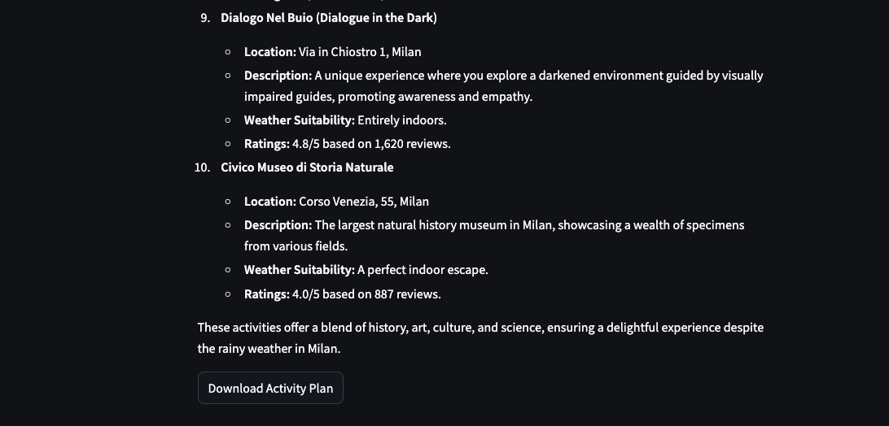

# CrewAI Agentic AI - Activity Planner based on Weather Forecast

## 📌 Project Overview

This project takes a hands-on approach to explore the power of agentic AI workflows using [CrewAI](https://www.crewai.com/). The main objective is to learn by doing and test how AI agents can autonomously retrieve and process weather data via API calls while leveraging CrewAI’s capabilities for multi-agent collaboration and decision-making.

Additionally, the project includes an Activity Planner, where an AI agent suggests indoor or outdoor activities based on real-time weather forecasts, user interests, and a selected date range and city.

The Streamlit application provides an interactive experience, allowing users to input their preferences, view weather forecasts, and receive activity recommendations, with the option to download the downloaded activities.

Below is a preview of how the application looks:

## 🎯 Objectives

- Understand CrewAI’s agent-based AI framework, including Crews, Agents, Tasks and Tools.
- Implement a simple AI agent that uses a custom Tool for weather data API calls.
- Explore collaborative agent workflows for enhanced decision-making.

## 🛠️ Tech Stack

- Python (3.12+ recommended)
- CrewAI
- OpenAI API
- [AccuWeather API](https://developer.accuweather.com/) (or any weather API of choice)
- Streamlit

## Details

Key Components:

    src/weather_crew/main.py:
    -> Main script file.

    src/weather_crew/crew.py:
    -> Main crew file where agents and tasks come together, and the main logic is executed.

    src/weather_crew/config/agents.yaml:
    -> Configuration file for defining agents.

    src/weather_crew/config/tasks.yaml:
    -> Configuration file for defining tasks.

    src/weather_crew/tools/custom_tools.py:
    -> Contains custom tools used by the agents.

Upon running the main.py script, the following results are saved:

    src/weather_crew/results/weather_forecast.md:
    -> Weather forecast for the specified location and date.

    src/weather_crew/results/activities_suggestion.md:
    -> Suggested activities for the location, date based on the weather forecast, including a brief description of the activities, why the activity is suitable for the weather forecast, and potential reviews/ratings.

## 🔄 Status

Project is: In Progress

#

📝 Author: Maria Dancianu

📅 Last Updated: March 2025
